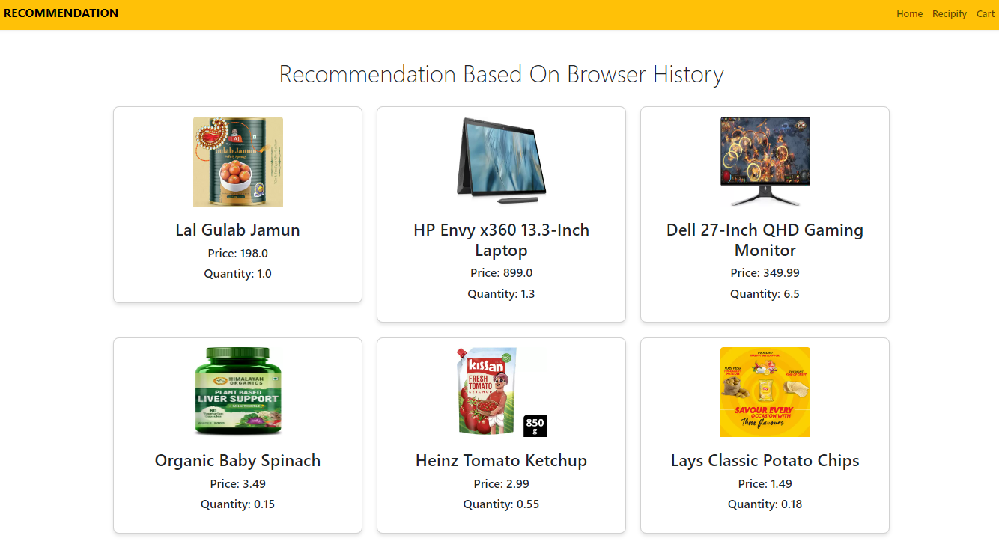

# FlipMart ✨ - A Personalized Product Recommender by Binary Coders

**FlipMart** is a personalized product recommendation system developed as part of the Flipkart GRID 5.0 program. It simulates the functionalities of an e-commerce platform by addressing the challenge of providing personalized product recommendations.

## Table of Contents ⏬
- [Use Case 1: Personalized Product Recommendations](#use-case-1-personalized-product-recommendations)
  - [1.1 Recommending items based on Past Purchase History](#11-recommending-items-based-on-past-purchase-history)
  - [1.2 Recommending items based on Ratings from Similar Users](#12-recommending-items-based-on-ratings-from-similar-users)
- [Use Case 2: Recipe Integration and Cart Management](#use-case-2-recipe-integration-and-cart-management)
- [Screenshots 🖼️](#screenshots)
- [Installation](#installation)
- [Support and Contact](#support-and-contact)

---

## Use Case 1: Personalized Product Recommendations 📍

### 1.1 Recommending items based on Past Purchase History 🛒
Users often purchase similar items repeatedly, especially in the grocery segment. To provide valuable recommendations based on previous orders, we established connections between a user’s current purchases and their past ones.  
We utilized the **Apriori Algorithm** from Association Rule Learning (ARL) to detect these associations between products.

### 1.2 Recommending items based on Ratings from Similar Users ⭐
Users from the same region may share common dietary habits and food preferences. To discover similar patterns among users, we applied **Memory-based Collaborative Filtering** using the **nearest neighbors algorithm**. This approach helps us analyze user rating data and recommend products that align with the preferences of users with similar tastes.

---

## Use Case 2: Recipe Integration and Cart Management 🛒

- **Exploring Recipes and Adding Ingredients:** Users can browse various recipes.
- **Viewing Recipe Details:** Allows users to see all the required ingredients and cooking instructions.
- **Adding Ingredients to Cart:** With one click, users can add recipe ingredients to their shopping cart.

---

## Screenshots 🖼️

---
##Home Page


##Recipify


##Recipi info


##Recommendation Based On Browser History


##Similar User


##Top Products


##Shopping Cart


## Installation

1. Clone the repository:
    ```bash
    git clone https://github.com/your-username/flipmart.git
    ```

2. Navigate into the project directory:
    ```bash
    cd flipmart
    ```

3. Install the required dependencies:
    ```bash
    npm install
    ```

4. Start the project:
    ```bash
    npm start
    ```

---

## Support and Contact

If you have any questions or need support, feel free to reach out to us at:  
📧 **support@flipmart.com**

You can also open an issue in the [issues section](https://github.com/your-username/flipmart/issues) on GitHub.
